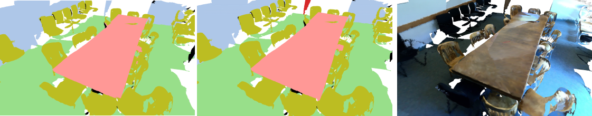

# PointConv
**PointConv: Deep Convolutional Networks on 3D Point Clouds.** CVPR 2019  
Wenxuan Wu, Zhongang Qi, Li Fuxin.

<p align="center">  </p>

## Introduction
This project is based on our CVPR2019 paper. You can find the [arXiv](https://arxiv.org/abs/1811.07246) version here.
```
@article{wu2018pointconv,
  title={PointConv: Deep Convolutional Networks on 3D Point Clouds},
  author={Wu, Wenxuan and Qi, Zhongang and Fuxin, Li},
  journal={arXiv preprint arXiv:1811.07246},
  year={2018}
}
```
Unlike images which are represented in regular dense grids, 3D point clouds are irregular and unordered, hence applying convolution on them can be difficult. In this paper, we extend the dynamic filter to a new convolution operation, named PointConv. PointConv can be applied on point clouds to build deep convolutional networks. We treat convolution kernels as nonlinear functions of the local coordinates of 3D points comprised of weight and density functions. With respect to a given point, the weight functions are learned with multi-layer perceptron networks and the density functions through kernel density estimation. A novel reformulation is proposed for efficiently computing the weight functions, which allowed us to dramatically scale up the network and significantly improve its performance. The learned convolution kernel can be used to compute translation-invariant and permutation-invariant convolution on any point set in the 3D space. Besides, PointConv can also be used as deconvolution operators to propagate features from a subsampled point cloud back to its original resolution. Experiments on ModelNet40, ShapeNet, and ScanNet show that deep convolutional neural networks built on PointConv are able to achieve state-of-the-art on challenging semantic segmentation benchmarks on 3D point clouds. Besides, our experiments converting CIFAR-10 into a point cloud showed that networks built on PointConv can match the performance of convolutional networks in 2D images of a similar structure.

## Installation
The code is based on [PointNet](https://github.com/charlesq34/pointnet)， and [PointNet++](https://github.com/charlesq34/pointnet2). Please install [TensorFlow](https://www.tensorflow.org/install/), and follow the instruction in [PointNet++](https://github.com/charlesq34/pointnet2) to compile the customized TF operators.  
The code has been tested with Python 2.7, TensorFlow 1.11.0, CUDA 9.0 and cuDNN 7.3 on Ubuntu 16.04.

## Usage
### ModelNet40 Classification
Please check [pointconv_pytorch](https://github.com/DylanWusee/pointconv_pytorch) for details on Classification task on ModelNet40 using pytorch.

### ScanetNet DataSet Segmentation

Download the ScanNetv2 dataset from [here](http://www.scan-net.org/), and see `scannet/README` for details of preprocessing.

To train a model to segment Scannet Scenes:

```
CUDA_VISIBLE_DEVICES=0 python train_scannet_IoU.py --model pointconv_weight_density_n16 --log_dir pointconv_scannet_ --batch_size 8
```

After training, to evaluate the segmentation IoU accuracies:

```
CUDA_VISIBLE_DEVICES=0 python evaluate_scannet.py --model pointconv_weight_density_n16 --batch_size 8 --model_path pointconv_scannet_%s --ply_path DataSet/ScanNetv2/scans
```

Modify the model_path to your .ckpt file path and the ply_path to the ScanNetv2 ply file.

## License
This repository is released under MIT License (see LICENSE file for details).
